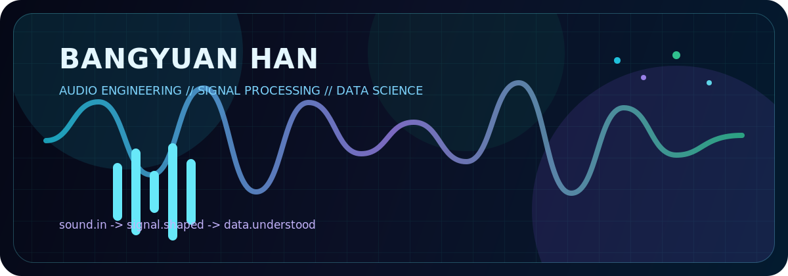

<div align="center">



[](https://git.io/typing-svg)

[](https://bangyuanhan.me)
[](https://github.com/HanBangyuan8)
[](https://github.com/HanBangyuan8?tab=followers)

</div>

<br>

<div align="center">

### `audio -> signal -> model -> insight`

</div>

```text
CURRENT FREQUENCIES

  48 kHz  | Audio engineering, production workflows, spatial listening
  20 Hz   | Signal analysis, filtering, transforms, feature extraction
  0 dBFS  | Data science, visualization, modeling, experiment design
  +12 LU  | Creative technology, tools, systems, and clean interfaces
```

<div align="center">

## Stack Console


</div>

<br>

<div align="center">

## Signal Telemetry


</div>

<div align="center">

## Trophy Rack


</div>

<br>

```text
SYSTEM STATUS

  input      : field recordings, sessions, datasets, experiments
  process    : DSP, analysis, modeling, iteration
  output     : tools, tracks, visuals, and decisions that feel clear
  website    : https://bangyuanhan.me
```

<div align="center">


</div>
